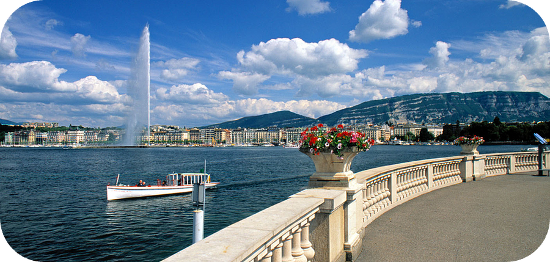

+++
title = 'Welcome'
date = 2015-05-10T14:09:38+02:00
draft = false
+++

I'm Florian, 28yo, passionate about software engineering and living in Geneva, Switzerland, from where I can enjoy a magnificent lake 🙂

Before that, I graduated from a French engineering university in 2012, Epitech.

This blog is going to be a way for me to share my passions, especially programming. Most of the content will probably be about Ruby/Rails and Go. You can contact me via Linkedin or Email.

And if you're in Geneva, and want to grab a coffee sometime, don't hesitate!
